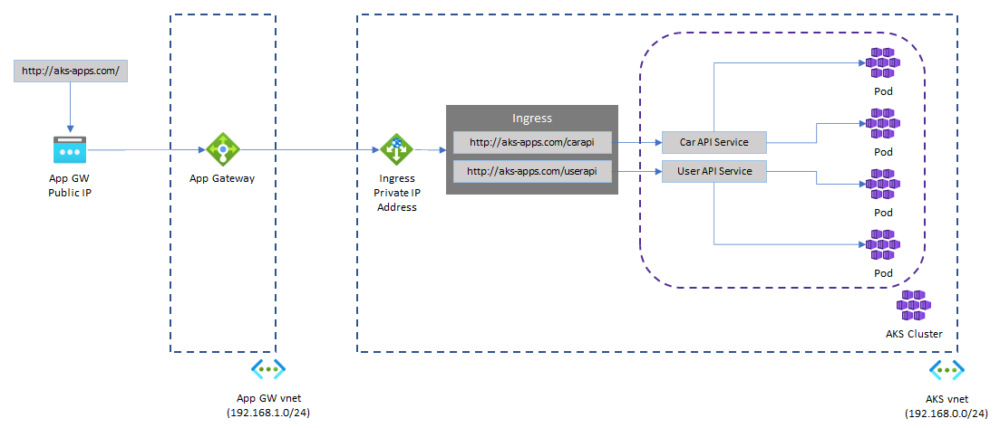

# Deploying Apps to Azure Kubernetes Service (AKS)

This repo will show you the basics of deploying containerized applications to AKS using Helm, exposing those apps through an Azure App Gateway  and distributing them through an NGINX Ingress controller, following the [Best practices for network connectivity and security for AKS](https://docs.microsoft.com/en-us/azure/aks/operator-best-practices-network#distribute-ingress-traffic). The diagram below illustrates the architecture diagram:





> **NOTE:** This repository does not bring into consideration critical aspects like securing access to your cluster and internal resources, which are very important when considering running production workloads on AKS. For more information, check out the [Best practices for cluster security](https://docs.microsoft.com/en-us/azure/aks/operator-best-practices-cluster-security?tabs=azure-cli) article.


## Prerequisites

- You can use a [Bash Azure Cloud Shell](https://shell.azure.com/bash),

- or you can run it locally on a Linux environment. In this case you need:
  
  - [Azure CLI]([How to install the Azure CLI | Microsoft Docs](https://docs.microsoft.com/en-us/cli/azure/install-azure-cli) v2.33.0 or later


## Getting Started

1. Once you are in your Azure Cloud Shell or your local Linux environment (see the prerequisites section above for more information), clone the repository:

```bash
git clone https://github.com/marvin-garcia/aks-playground.git
```

2. Run the AKS deployment script and follow the wizard instructions:

```bash
cd aks-playground
./deployment/aks/deploy.sh
```

3. Once the deployment script has completed, it will print the endpoint to test each application that has been deployed in the cluster. It will look like the output below:

```textile
http://aks-apps-123456.eastus.cloudapp.azure.com/carapi/cars
http://aks-apps-123456.eastus.cloudapp.azure.com/userapi/users/1
http://aks-apps-123456.eastus.cloudapp.azure.com/consoleapi/consoles/1
```


