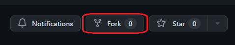

# Deploying Apps to Azure Arc-enabled Kubernetes clusters

[Azure Arc-enabled Kubernetes](https://docs.microsoft.com/en-us/azure/azure-arc/kubernetes/overview) allows you to attach and configure Kubernetes clusters running anywhere. You can connect your clusters running on other public cloud providers (such as GCP or AWS) or clusters running on your on-premises data center (such as VMware vSphere or Azure Stack HCI) to Azure Arc.

When you connect a Kubernetes cluster to Azure Arc, it will:

- Be represented in Azure Resource Manager by a unique ID
- Be placed in an Azure subscription and resource group
- Receive tags just like any other Azure resource

Azure Arc-enabled Kubernetes supports industry-standard SSL to secure data in transit. For the connected clusters, cluster extensions, and custom locations, data at rest is stored encrypted in an Azure Cosmos DB database to ensure confidentiality.

## Using GitOps with Flux v2 and Azure Arc-enabled Kubernetes clusters

Managing infrastructure at scale has always been a challenge, specially when resources are spread geographically with different and unique environment constraints. [Azure Arc](https://docs.microsoft.com/en-us/azure/azure-arc/overview) helps with the visibility and governance of servers, databases and Kubernetes clusters. They appear in the Azure portal, collect metrics through Azure Monitor and are governed by Azure Policies, as if they were just another Azure resource.

Traditionally, CI/CD practices for containerized apps and microservices utilize a push philosophy: whenever there is a change in one of your applications, a new Docker image is built and pushed to a container registry, and the new image version is then pushed to Kubernetes either via manifests or charts like Helm. This model becomes too rigid when one is supposed to deploy the same application at scale, and that is what the GitOps paradigm aims to solve: GitOps treats each software or infrastructure component as one or more files in a version control system (Git, Bucket), with an automated process to syncrhonize state between the version control and the runtime environment. This is a radical change because it allows IT teams to use infrastructure-as-code (IaC) with the same version control processes that developers have used for decades, adding consistency and standardization to infrastructure management at scale. Since Kubernetes provide the concept of immutability and resource definition in a declarative way, it is much easier to put measures to prevent configuration drifts compared to traditional VM-based deployments. Tools like [Flux](https://fluxcd.io/docs/) and [Argo CD](https://argo-cd.readthedocs.io/en/stable/) run on this principle, establishing a single source of truth (a version control system) for all application and infrastructure deployments. Additionally, they implement a pull method (as opposed to pushing a manifest or charts to a cluster), making it much easier to target multiple clusters regardless of their physical locations, just by connecting them to the version control system and pushing the resources declaration to it.

This repo will help you understand how you can deploy applications at scale using Azure Arc-enabled Kubernetes and Flux v2. The following steps describe what is done by the deployment wizard:

1. It creates one or more Ubuntu Azure Virtual Machines in the same network address space

2. Installs the lightweight version of [Rancher K3s](https://k3s.io/) on each VM

3. Installs the Azure Arc-enabled Kubernetes agent on each cluster

4. Installs the following Microsoft Kubernetes extensions on each cluster: `Flux`, `Policy Insights`, `Azure Defender for Kubernetes`, `Azure Monitor for Containers`

5. Enables GitOps on each cluster

6. Creates a [Flux configuration](https://docs.microsoft.com/en-us/cli/azure/k8s-configuration/flux?view=azure-cli-latest) to manage all the Helm release sources (in the form of `HelmRepository` objects) that will be needed

7. Creates a [Flux configuration](https://docs.microsoft.com/en-us/cli/azure/k8s-configuration/flux?view=azure-cli-latest) to manage NGINX Ingress controller as part of the clusters' infrastructure config

8. Creates a [Flux configuration](https://docs.microsoft.com/en-us/cli/azure/k8s-configuration/flux?view=azure-cli-latest) to manage a Flask web app as part of the clusters' application config

> **NOTE**: This repository is a more compact version of the [Azure Arc Jumpstart](https://azurearcjumpstart.io/azure_jumpstart_arcbox/) project, which provides sandbox environments for IT Pros and Developer audiences. If you are looking for a broader approach to learning Azure Arc for Kubernetes, definitely check out the amazing work they have done and come back here when you want to focus more on the GitOps side of the story.

> **NOTE:** This repository does not bring into consideration how to manage on-prem Kubernetes clusters or which version to use. Azure Arc works with any Cloud Native Computing Foundation (CNCF) certified Kubernetes clusters.

### Architecture

the image below illustrates the resources that are deployed and how they are configured:


### Flux Configurations

Probably the most important part of GitOps, is having a clear structure and separation of what will be deployed to the clusters and how they have dependencies on each other. The image below shows the repository's folder structure that is relevant to Flux and what each component represents.

```textile
aks-playground/
├── apps
│   ├── kustomization.yaml
│   └── voteapp
│       ├── kustomization.yaml
│       ├── namespace.yaml
│       └── release.yaml
└── infrastructure
│   ├── ingress-nginx
│   │   ├── chart
│   │   ├── k3s-<uniqueId>-<clusterIndex>
│   │   │   ├── kustomization.yaml
│   │   │   └── values.yaml
│   │   ├── kustomization.yaml
│   │   ├── namespace.yaml
│   │   └── release.yaml
│   ├── kustomization.yaml
│   └── redis
│       ├── kustomization.yaml
│       ├── kustomizeconfig.yaml
│       ├── namespace.yaml
│       ├── release.yaml
│       └── values.yaml
└── sources
    ├── bitnami.yaml
    ├── ingress-nginx.yaml
    ├── kustomization.yaml
    └── voteapp.yaml
```


#### Kustomize

[Kustomize](https://kubernetes.io/docs/tasks/manage-kubernetes-objects/kustomization/) is a tool for customizing Kubernetes configurations by:

- Generating resources from other sources

- Setting cross-cutting fields for resources

- Composing and customizing collections of resources

Every folder that is relevant to the Flux configuration contains a `kustomization.yaml` file. These files define which resources will be considered as part of the Kustomize configuration and whether any patching is required for a more specific configuration. 

Below is the content of `apps/kustomization.yaml`, it instructs Flux to look into the `voteapp` folder for additional Kustomization references, which can define objects like **HelmRepository**, **HelmRelease** or simply **Kubernetes manifests**.

```yaml
## apps/kustomization.yaml
apiVersion: kustomize.config.k8s.io/v1beta1
kind: Kustomization
resources:
  - voteapp
```


The folder `sources` contains `HelmRepository` objects that will be used in the solution. [HelmRepository](https://fluxcd.io/docs/components/source/helmrepositories/) objects specify the location of a [Helm Chart](https://helm.sh/). Those charts can be located at an OCI Helm repository (like [like Azure Container Registry](https://docs.microsoft.com/en-us/azure/container-registry/container-registry-image-formats#oci-images)) or an HTTP/HTTPS repository like Git (follow this great [article](https://medium.com/@mattiaperi/create-a-public-helm-chart-repository-with-github-pages-49b180dbb417) to create a public Helm chart repository with GitHub Pages and look at the [helm-package.yaml](../../.github/workflows/helm-package.yaml) workflow to learn how to package and index your Helm charts in GitHub).

> **NOTE:** For secret repositories, your `HelmRepository` you must provide a [Secret reference](https://fluxcd.io/docs/components/source/helmrepositories/#secret-reference).


The folders `app/voteapp`, `infrastructure/ingress-nginx` and `infrastructure/redis` contain the Kustomize configurations for each app or release. They all define (for the most part) the same Kubernetes resources:

- [Namespaces](https://kubernetes.io/docs/concepts/overview/working-with-objects/namespaces/) objects define logical boundaries to isolate groups of resources within a cluster. In our case, each release will have a namespace for itself.

- [HelmRelease](https://fluxcd.io/docs/components/helm/helmreleases/) objects define a resource that will be reconciliated via Helm actions such as install, upgrade, test, uninstall and rollback. The `.spec` object expects almost the same parameters as the `helm install/upgrade` commands: the target namespace to install the release, the repo location (in this case, referencing a `HelmRepository` object), and override values for the release if needed.

- [Kustomization](https://kubectl.docs.kubernetes.io/references/kustomize/glossary/#kustomization) objects specify all the resources that will be used by Kustomize. Below is the content of `infrastructure/ingress-nginx/kustomization.yaml`, and despite having other files in the same folder, Kustomize will ignore them until they are added as a Kustomization resource.

```yaml
apiVersion: kustomize.config.k8s.io/v1beta1
kind: Kustomization
resources:
 - repository.yaml
 - namespace.yaml
 - release.yaml
```

> **IMPORTANT:** `ingress-nginx` and `redis` folders show different approaches to reconciliate their configurations. `redis` stores release values in a [ConfigMaps](https://kubernetes.io/docs/concepts/configuration/configmap/) object, while `ingress-nginx` only provides a subset of the values needed for the release. The next section explains how the configuration for each cluster is patched with the one declared in `ingress-nginx` to create unique releases.


> **TIP:** To see the full output of a **Kustomize** configuration, use the command `kubectl kustomize <kustomization_directory>`, it will print the manifest containing all components.


##### k3s-\<uniqueId>-\<clusterIndex\>

> **NOTE:** These folders are not present in the `main` branch of the repo. They will be created during the deployment process that will be explained later in this document.

Since the ingress controller requires an IP address to listen to (passed through `controller.service.externalIPs[]`), every cluster in this sandbox deployment will require their own `HelmRelease` definition with their private IP Address.

>  **IMPORTANT:** This is a very common scenario where certain configurations require unique parameters. The way the GitOps paradigm solves it is by separating the application code and release configurations in different repositories, and pushing the infrastructure and application releases to the release configuration repository as part of their CI/CD pipelines triggered by changes in the application code. This also creates security boundaries by not letting developer and IT teams tamper with the final state of the releases; they must commit their changes via their version control system which will be submitted for review and approved via pull requests, and the CI part of CI/CD will have the necessary permissions to commit changes to the release configuration repository. For simplicity's sake, this project "isolates" the release configuration for ingress controller by creating a folder for each k3s cluster and customizing its `values.yaml` file with the VM's private IP address.


#### Creating Flux Configuration in a cluster

Azure Arc for Kubernetes allows us to install extensions in the cluster so it can understand new resource types and apply their configurations. This repository install the `Microsoft.Flux` extension on each cluster and then creates two Flux configurations using the [az k8s-configuration flux](https://docs.microsoft.com/en-us/cli/azure/k8s-configuration/flux?view=azure-cli-latest) CLI extension. Let's discuss both configurations:

- NGINX: It is responsible for monitoring the Kustomize configuration that install NGINX Ingress controller for each cluster, located in the path `infrastructure/<cluster_name>` of your repository branch. As discussed previously, each cluster's ingress release requires a different IP address, resulting in separate folders for each cluster.

- Apps: It is responsible for monitoring the Kustomize configuration declared in `apps/kustomize.yaml`, which in our case is only the `voteapp` application. But since the `voteapp` application has a dependency on a Redis cache, the Flux configuration implements two different kustomization objects. Below is a sample command to create the **apps** Flux configuration, notice how the `apps` kustomization has a dependency on `redis`, which determines the order in which Flux will create and update them.

```bash
az k8s-configuration flux create \
  -g $resourceGroupName \
  -c $clusterName \
  -n apps \
  -t connectedClusters \
  -u $repoUrl \
  --branch $repoBranch \
  --kustomization name=redis path=./infrastructure/redis \
  --kustomization name=apps path=./apps dependsOn=["redis"]
```

> **TIP:** Take a look at the [deployment script](../../deployment/azure-arc/deploy.sh) for a full view on how the configurations are created on each cluster.


Now that you have a high level understanding of the key concepts and the structure of the repository, let's move on to deploying your Azure Arc environment.


## Prerequisites

- You can use a [Bash Azure Cloud Shell](https://shell.azure.com/bash),

- or you can run it locally on a Linux environment. In this case you need:
  
  - [Azure CLI](https://docs.microsoft.com/en-us/cli/azure/install-azure-cli) v2.33.0 or later
  
  - The Json processor **jq**. Use your typical distribution package manager to install it (i.e., `sudo apt install jq` for Ubuntu and Debian)


## Getting Started

1. You must fork the repo to your account so you can commit changes related to the clusters' ingress configuration. On your browser, go to `https://github.com/marvin-garcia/aks-playground`, click the `Fork` button on the top right corner and follow the instructions to add it to your GitHub's organization.



2. Open Azure Cloud Shell or a local Linux console (see the prerequisites section above for more information), clone the repository you just forked:

```bash
git clone https://github.com/<your-github-org-name>/aks-playground.git
```

3. The deployment wizard will create new files and commit them to your repo. If you want to avoid hosting cluster configurations for infrastructure that you won't care about, consider using a new branch.
   
   > **NOTE:** This new branch will be associated with the Flux configuration of your clusters' environments. Changes in other branches of your repository won't have any effect in this environment.

```bash
git checkout -b <your-new-branch-name>
git push
```

4. Run the Azure Arc deployment script and follow the wizard instructions:

```bash
cd aks-playground
./deployment/azure-arc/deploy.sh
```

5. Once the deployment script has completed, it will print the endpoint to the web app on each cluster. For example, it will look like the output below:

```textile
Resource Group name: arc-k8s-a24e4574
Cluster(s) public endpoints:
- http://k3s-a24e4574-1.eastus2.cloudapp.azure.com/
- http://k3s-a24e4574-2.eastus2.cloudapp.azure.com/
- http://k3s-a24e4574-3.eastus2.cloudapp.azure.com/
```

6. On your browser, navigate to any of the clusters' endpoints. You should see the main page of the Vote app.

7. Go back to the Azure Cloud Shell or your local Linux console and open the [voteapp release](../../apps/voteapp/release.yaml) file. Change the value of the property `values.image.tag` to `2207072232`. Commit and push your changes.

```bash
git add apps/voteapp/release.yaml
git commit -m 'updated voteapp release version'
git push
```


8. Wait a few minutes until the Flux configuration has noticed the release change and pulled it to all the k3s clusters. On your browser, navigate to any of the clusters' endpoints. An app version should now appear at the bottom of the page.


> **TIP:** You will notice that inside the `infrastructure` folder there are one or more folders with the names of the clusters you created through the deployment wizard. Explore the `release.yaml` and `kustomization.yaml` files to understand how to patch releases and apply environment-specific configurations at scale.


You can use the [Azure Bastion](https://docs.microsoft.com/en-us/azure/bastion/bastion-overview) in your resource group to connect via SSH to the virtual machines running k3s. Once logged in, you can use `kubectl` and `helm` to explore all the Helm releases and Kubernetes resources that were created by Flux. If you want to see this information in the Azure Portal, follow [these instructions](https://docs.microsoft.com/en-us/azure/azure-arc/kubernetes/cluster-connect?tabs=azure-cli#service-account-token-authentication-option) to grant access to your clusters.

> **TIP:** Use your private SSH key located at `~/.ssh/id_rsa` to connect to the virtual machines through Azure Bastion.
